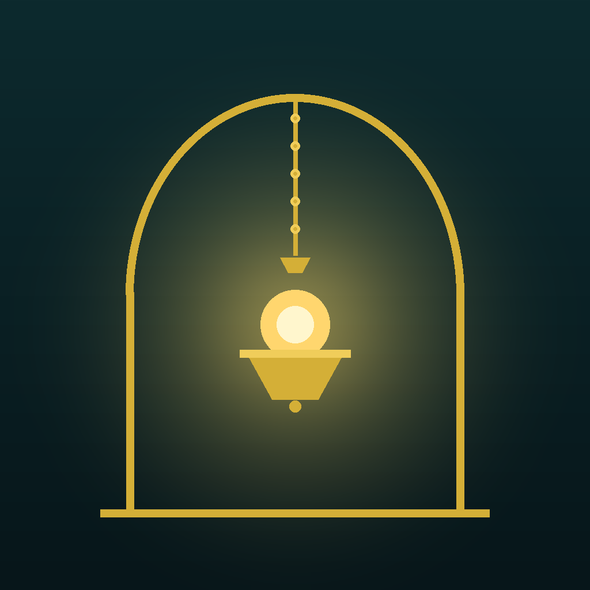

# السلام عليكم، أنا الهمال دنا 👋

**مسلم جزائري سنّي، متفائل بغدٍ أجمل 🌅**

أبني تطبيقات عربية مفتوحة المصدر تحمل النور والمعرفة — من الجزائر إلى كل الناطقين بالضاد.

---

## 🕯️ مشاريعي

| المشروع | الوصف | التقنية |
|---|---|---|
| **[نبراس](https://github.com/mwqwf/nebras)** 💡 | منصة معرفية عربية متكاملة: تطبيق + لوحات تحكم + موقع | Kotlin/Compose · SvelteKit · Flutter |
| **[منبر ادكصهك](https://github.com/mwqwf/minbar-adkshk-oss)** 🎙️ | دروس صوتية إسلامية — منشور على Google Play | Kotlin/Compose · Firebase |
| **[مشكاة الهداية](https://github.com/mwqwf/mishkat-alhidaya)** 📚 | مكتبة إسلامية رقمية للجوال تعمل دون اتصال | React Native/Expo |

## 🛠️ ماذا أستعمل

`Kotlin` `Jetpack Compose` `Firebase` `Python` `SvelteKit` `Next.js`

## 🌟 فلسفتي

> أحب المشاريع التي تبقى وتنفع — كل سطر كود أكتبه أريده مصباحاً يضيء لغيري.

